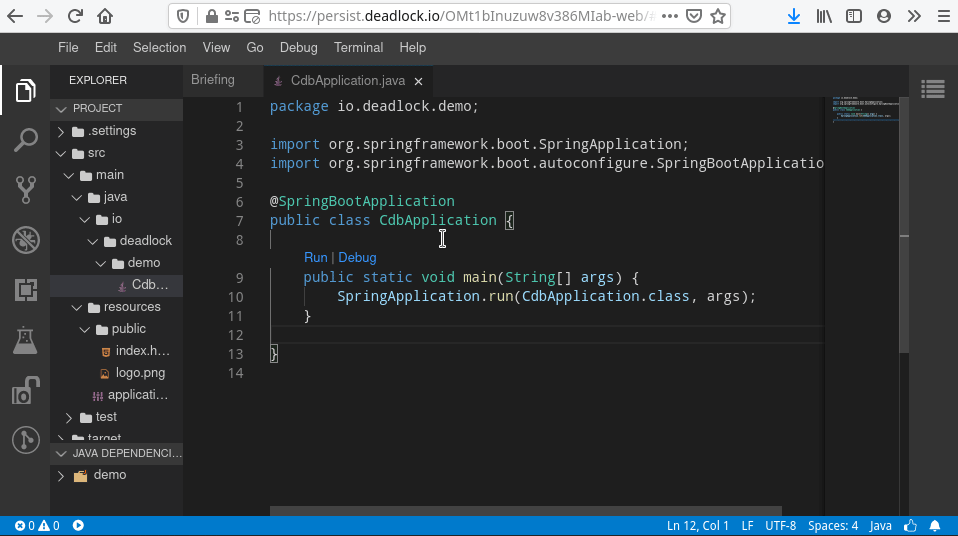

# Challenge VsCode

Les autres types de challenge ne vous conviennent pas ? 
Vous vous sentez à l'étroit ? Vous voulez que vos étudiants puisse profiter d'un éditeur complet ?

Il est temps d'utiliser VsCode dans le navigateur !  
Mais avant toute chose, vous devez être familier avec le [DCLI et les bases de création de missions](../../#pour-commencer)




## Comment ?

Il vous suffit de créer les fichiers suivants : 

```S
├── base
│   ├── src   
│   │   ├── main   
│   │   │   ├── java                  
│   │   │   │   └── io
│   │   │   │       └── deadlock
│   │   │   │           └── demo
│   │   │   │               └── CdbApplication.java
│   │   │   └── resources/
│   │   └── test/
│   └── webapp/
├── challenge.yaml
├── Dockerfile
├── docs
│   └── briefing.md
└── thumbnail.png
```

* **base** dossier contenant les fichiers utilisateurs, ces fichiers seront fournis au candidat lorsque l'IDE démarre.
* **docs** contient le briefing, les instructions utilisateurs. Le briefing sera ouvert au démarrage de l'IDE. 
* **Dockerfile**
```Dockerfile
FROM registry.e-biz.fr/deadlock-public/deadlock-theia:latest

# Vous pouvez installer tout ce que vous voulez
# Le gestionnaire de package est *apt*

# les path de destination paths ne doivent pas être modifiés
COPY base /project # copie le repertoire user dans /project
COPY docs /home/theia/docs # copie les instructions
```
* **challenge.yaml** est le fichier descripteur
```Yaml
version: 0.1
name: code_persist_crud
label: Crud
description: This is your moment, you have to create your own CRUD. Your customer requested you to build a Computer DataBase application (codename *CDB*).
level: ewok # difficulté du challenge [comment ça marche](https://deadlock-resources.github.io/challenge-documentation/#level)
type: PERSISTENT # obligatoire
xp: # points d'expérience, vous pouvez ajouter les labels que vous voulez
  programming: 1 # c'est un poids, pas un nombre
  java: 1
coding:
  userDirectory: base
resources: # Ressources allouées au conteneur, ne pas modifier si vous n'êtes pas confiant sur le sujet
  cpuLimit: "1200m"
  memoryLimit: "1200Mi"
  cpuRequest: "1000m"
  memoryRequest: "1000Mi"
persistent:
  ports: # ports que vous souhaitez laisser ouvert pour le candidat
    web: 3000 # obligatoire
    crud: 9090 # la personne se verra attribuer une url qui redirigera vers le port 9090
```
* **thumbnail.png** image du challenge 

### Ajouter des images au briefing
```


```
Vous devez préfixer le path de votre image avec **image:**


## Comment tester ?
```Bash
> cd ./code_persist_crud
> dcli run .
```
Cela vou donnera un lien cliquable que vous pourrez copier dans votre navigateur préféré.

## Ajout de services au démarrage

Imaginons que vous ayez besoin d'un service au démarrage d'une mission.  
Par exemple une base de données Postgres

Il vous suffit d'ajouter un script `startup.sh` dans votre image Docker :  
`COPY startup.sh /deadlock/startup.sh`

et par exemple à l'intérieur de ce `startup.sh` :  
```bash
#!/bin/sh

# Launch postgres service on startup
service postgresql start
```

Le script `startup.sh` s'exécute lorsque le conteneur Docker démarre.

*Si vous avez besoin de remplir la base de données, il est préférable de le faire dans le Dockerfile (utiliser un script au démarrage va allonger le démarrage du container) :*
```Dockerfile
# installation de Postgresql
RUN apt-get -y update
RUN apt-get -y install postgresql

USER postgres

COPY db/sql /sql
# remplissage de la base de données
RUN /etc/init.d/postgresql start &&\
    psql --command "CREATE USER deadlock WITH SUPERUSER PASSWORD 'no-passwd';" &&\
    createdb -O deadlock deadlock-db &&\
    psql -d deadlock-db -U deadlock -f /sql/1__schema.sql -f /sql/2__entries.sql &&\
```
