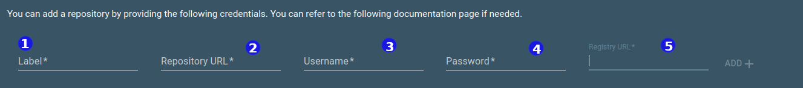
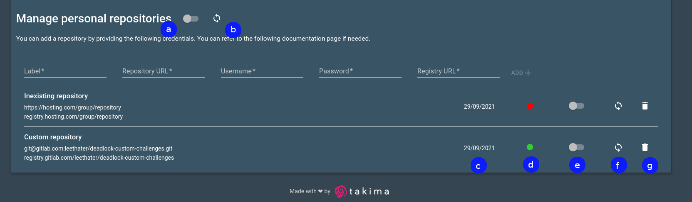

# Guide pour administrateurs Deadlock

Ici, nous allons vous expliquer comment ajouter un répertoire Git à votre instance Deadlock.

## Fournir votre clé SSH publique aux mainteneurs

Pour permettre à Deadlock de récupérer les missions depuis un répertoire privé, son mainteneur doit ajouter votre clé SSH
publique à la liste des clés de déploiement.

Votre clé SSH se trouve dans *~/.ssh/id_rsa.pub*, si vous ne possédez pas de clé SSH, vous pouvez en générer une avec la commande `ssh-keygen`. 

> La clé SSH est obligatoire pour que vos nouvelles missions s'affiche dans votre catalogue mais vous ne serez pas en mesure
> de lancer vos missions si vous ne fournissez pas un [token d'authentification correct](#ajouter-un-repertoire)

Si vous êtes également mainteneur de votre répertoire, vous trouverez plus d'information dans notre[guide du mainteneur](maintainer-guide.md).

## Ajouter un répertoire

Pour ajouter un répertoire à votre instance Deadlock, vous devez remplir les informations suivantes :

- **(1)** un *libellé* pour identifier votre répertoire
- **(2)** *l'URL du répertoire*, par exemple `git@gitlab.com:username/challenges.git` ou `https://gitlab.com/username/challenges`
- **(3)** *le nom d'utilisateur* depuis le token du registre
- **(4)** *le mot de passe* depuis le token du registre
- **(5)** *l'URL du registre* sous la forme `registry.gitlab.com.username/challenges`

___

## Gérer des répertoires

Sur l'écran de gestion, vous retrouvez les informations suivantes : 

- **(a)** active ou désactive le synchroniseur global qui synchronise tous les répertoires une fois par jour
- **(b)** déclenche une synchronisation de tous les répertoires (une fois)
- **(c)** date de création du répertoire
- **(d)** dernier statut de synchronisation : *vert* si elle a réussie et *rouge* si elle a échouée
- **(e)** active ou désactive la synchronisation planifiée une fois par jour pour le répertoire associé
- **(f)** déclenche la synchronisation d'un repertoire spécifique
- **(g)** supprime un répertoire

> Deadlock se maintient à jour avec les répertoires de missions. Ces *mises à jour* peuvent être automatique ou manuelles.
> Une mise à jour comprend le téléchargement des nouvelles missions et la suppression des missions qui ont disparu du répertoire.

## FAQ

> Sera rempli par les réponses aux questions fréquemment posées.
