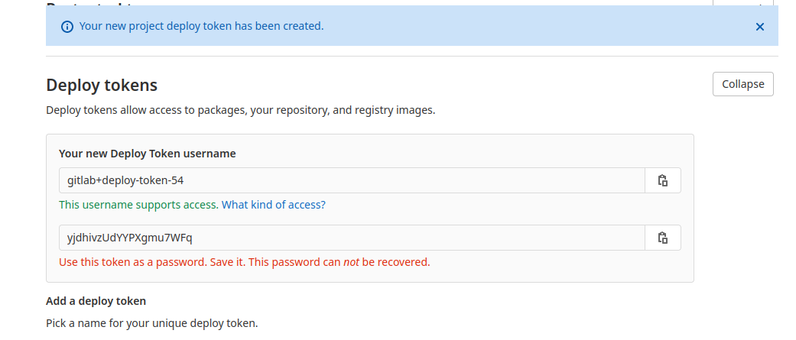

# Guide pour les mainteneurs de répertoire

Cette page va vous guider dans l'installation et la configuration de votre propre répertoire de missions Deadlock.

## Créer votre répertoire *GitLab*

Avant tout, il vous faut un répertoire git pour stocker vos missions. Deadlock ne supporte pour le moment que des répertoires
hébergés sur *GitLab* (aussi bien les répertoires hébergés sur l'instance gitlab par défaut que sur des instances personnalisées).

Le répertoire peut être publique ou privé.

Nous vous recommandons [ce template](https://git.e-biz.fr/deadlock-public/deadlock-challenges-example) 
pour commencer étant donné qu'il contient les scripts pour automatiquement construire vos images avec une CI toute prête.

> **Important**: Deadlock récupère les missions depuis la branche **master/main**, assurez vous d'en avoir une.

## Ajouter vos missions sur votre répertoire *GitLab*

Désormais, vou pouvez remplir le dossier **resources** avec vos missions. 
Si vous n'êtes pas familier avec le processus de création et de test de missions avec **DCLI**,
vous pouvez trouver plus d'informations [ici](../index.md).


## Construire et ajouter vos images de missions sur le registre de votre conteneur

Si vous utilisez notre template comme point de départ, vous trouverez un fichier `.gitlab-ci.yml` qui construira automatiquement
vos missions et les ajoutera à votre registre.

Si vous préférez le faire manuellement, vous pouvez suivre la procédure suivante :

1. Se connecter à votre registre  

```bash
# Example with gitlab.com 
docker login registry.gitlab.com -u <username> -p <token>
```


2. construire et ajouter l'image de la mission  

```bash
# Example with gitlab.com 
cd resources/my_challenge
docker build -t registry.gitlab.com/your_group/project_name/my_challenge:version .
docker push registry.gitlab.com/your_group/project_name/my_challenge:version
```

> **Important**: *my_challenge:version* doit correspondre au nom et à la version de votre mission que vous avez défni dans le fichier `challenge.yml`.

Vous pouvez vous rendre sur la page de [documentation de gitlab][gitlab_doc] pour plus de détails.

## Rendre votre répertoire disponible pour une instance de Deadlock

Pour que vos missions deviennent visibles et exécutables depuis une instance de Deadlock, vous devez ajouter leur clé SSH en
tant que clé de déploiement et la fournir à la plateforme Deadlock accompagné de la paire *username:password*.

### Ajouter la clé SSH de l'instance à votre list de clé de déploiement

Pour cette étape, vous aurez besoin de la clé SSH publique de l'instance Deadlock sur laquelle vous voulez ajouter vos missions.
Si vous n'en possédez pas, vous pouvez contacter un adminsitrateur Deadlock pour vous en communiquer une.

Une fois que vous serez en possession de cette clé SSH publique, ajoutez la à la liste des clés de déploiement de votre
*GitLab* qui se trouve dans **Settings->Repository->Deploy Keys**. Il n'est pas nécessaire de donner les permissions d'écriture à cette clé.


### Générer un token de déploiement

Il faut désormais générer un token de déploiement que vous fournirez à Deadlock.

Pour cela rendez-vous dans **Settings->Repository->Deploy Tokens** et générer un token avec la permission **read_registry**.

Une fois que vous aurez généré un token, il vous sera communiqué un username et un mot de passe. Nous vous recommandons
de copier le mot de passe car il ne sera pas possible de le récupérer avec avoir quitté la page.



Ce token est nécessaire pour que l'administrateur Deadlock puisse ajouter votre répertoire et exécuter vos missions.

Si vous avez accès à la page de manager Deadlock, vous pouvez continuer le processus dans notre [guide de l'admin](admin-guide.md).

## FAQ

> Sera rempli par les réponses aux questions les plus posées.

[gitlab_doc]: https://docs.gitlab.com/ee/user/packages/container_registry
