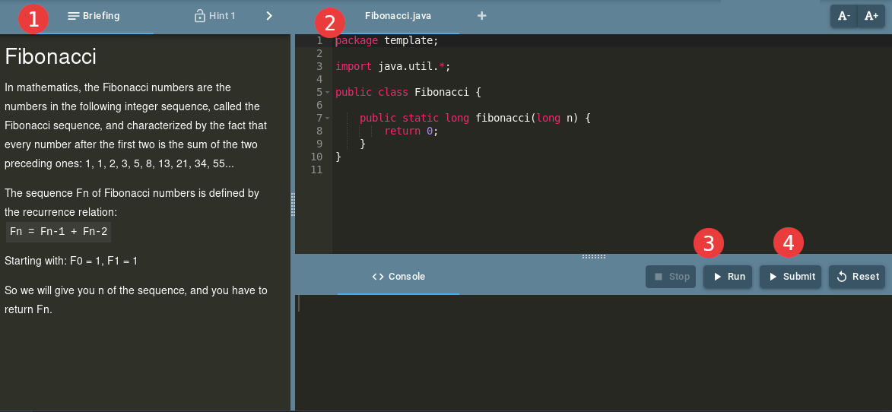
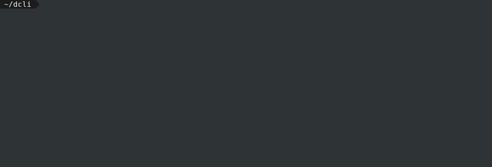

# Missions dans Deadlock

---

## Vue d'ensemble

Cette documentation a pour but de vous guider dans la création de votre propre support d'apprentissage à travers la plateforme Deadlock.  
Dans un premier temps nous allons aborder les missions dites 'classiques' mais il existe d'autre type de missions que vous retrouverez à la [fin de ce guide](#et-apres)

## Une mission, c'est quoi ?
Une mission est principalement composée des éléments suivants :

* Une documentation : les instructions pour l'utilisateur
* Un dossier template : le code fourni à l'utilisateur
* Un dossier success : la solution de la mission
* Un dossier app : la logique pour vérifier le code de l'utilisateur
* Un descripteur de mission : challenge.yml
* Plusieurs indices : vous pouvez ajouter différents indices qui seront débloqués par l'utilisateur en utilisant des jetons

L'interface utilisateur ressemble donc à ceci : 



1. La documentation avec le briefing (informations principales) et les indices
2. Le code fourni
3. Le bouton Exécuter qui lance le code de l'utilisateur sans tests (vérification de syntaxe, ...)
4. Le bouton Soumettre qui exécute le code de l'utilisateur avec les tests

## Pour Commencer
Chaque mission possède une structure spécifique fournie par notre [outil DCLI](https://github.com/deadlock-resources/dcli).
Démarrer une mission est assez facile, vous n'avez qu'à vous soucier de ce que vous désirez fournir à vos utilisateurs.

### Installation de DCLI
Pré-requis :

* Docker ([à installer en non-root](https://docs.docker.com/engine/install/linux-postinstall/#manage-docker-as-a-non-root-user))
* Python >= 3.2
* pip installé ([avec python](https://pip.pypa.io/en/stable/installing/) ou depuis votre gestionnaire de package)

Une fois les pré-requis installés vous pouvez installer le [dcli](https://pypi.org/project/deadlock-cli/) via pip :  
`pip3 install deadlock-cli`  


Ensuite vous devriez pouvoir utiliser la commande `dcli` depuis votre terminal. Exécuter la commande `dcli --help` pour vérifier que tout fonctionne.  
*Si la console affiche un message du type `command not found` ou `module not found` quand vous exécuter la commande `dcli`, essayer d'exporter `/home/user/.local/bin` dans votre variable $PATH.*
```bash
> dcli --help
# man page should be printed
> dcli version
current is 1.2.0
```

### Créer votre premier challenge
Nous allons créer une mission Java pour expliquer le concept derrière la structure.
Java est utilisé pour l'exemple, dès que vous aurez compris l'architecture, vous serez
en mesure de créer une mission dans n'importe quel langage.  
De plus `dcli` peut générer
des missions dans d'autres langages, vous pouvez vous inspirer de [nos exemples](https://github.com/deadlock-resources/challenge-examples).

Commençons par l'exemple Java :  

```bash
> dcli gen java
```
Nous allons créer une mission simple où l'utilisateur doit juste afficher `Hello World!`.



Explorons le dossier généré `code_hello_world` par `dcli` :
```bash
code_hello_world/
├── docs
│   ├── briefing.md
│   └── fr
│       └── briefing.md
├── src
│   └── main
│       └── java
│           ├── app
│           │   ├── Logger.java
│           │   ├── Solve.java
│           │   └── Run.java
│           ├── success
│           │   └── HelloWorld.java
│           └── template
│               └── HelloWorld.java
├── challenge.yml
├── Dockerfile
├── run.sh
└── thumbnail.png

```

La mission est simple, implémenter la méthode `sayHello()` au sein du package `template`.
Tous les fichiers dans le package `template` seront fournis à l'utilisateur, vous pouvez en créer autant que vous le désirez.  

*Le fichier `HelloWorld.java` dans le package `success` ne sera fourni à l'utilisateur que lorsqu'il aura réussi la mission.*

Vous devez résoudre tous les `//TODO` présents dans le code.  
Commençons par `src/main/java/success/HelloWorld.java`, il s'agit du fichier de solution.
```java
public static String sayHello() {
    //TODO write your own solution
    return null;
}
```
La méthode doit simplement retourner `"Hello World!"`.  
L'étape suivante consiste à comparer le résultat de l'utilisateur avec le résultat attendu, cela est effectué dans `src/main/java/app/Solve.java`.  
DCLI génère certaines parties de code pour vous, mais vous devrez le compléter avec votre propre algorithme.
``` java
public static void main(String[] args) {
    try {
        // user result
        String userResult = HelloWorld.sayHello();
        // your solution result
        String expectedResult = success.HelloWorld.sayHello();
        //TODO you have to do different tests to be sure user has the good solution.
        // comparing userResult and expectedResult

        if (expectedResult.equals(userResult)) {
            // if all test passed successfully
            Logger.logSuccess();
        } else {
            Logger.logFail(expectedResult, userResult);
            System.exit(1);
        }
    } catch (RuntimeException e) {
        Logger.logException(e);
        // if something bad happened exit with error code
        System.exit(1);
    }
}
```
Le code ci-dessus logue une erreur et s'arrête avec un code d'erreur si la fonction `HelloWorld.sayHello()` 
ne retourne pas "Hello World!" ou si elle lance une exception.

En général, il y a 2 types de résultats que vous devez prendre en considération.

1. Error : Le code ne compile pas, la fonction n'a pas la bonne signature, le code ne retourne pas le résultat attendu, quelque chose d'autre s'est mal passé.
2. Success : Le code compile, s'est terminé normalement et retourne le résultat attendu.

Une simple classe `Logger` est également générée.  
Vous pouvez maintenant tester votre mission avec les commandes suivantes : 
```Bash
> cd ./code_hello_world
> dcli run . # Run the program, execute the file `src/main/java/app/Run.java`
> dcli solve . # Run the program with your tests, execute the file `src/main/java/app/Solve.java`
```
Essayer de modifier le fichier `HelloWorld.java` du package template pour compléter la mission comme si vous étiez un candidat. 

### Documentation
La documentation de la mission est disponible dans **code_hello_world/docs/**.  
Elle contient le briefing qui expose le problème que le candidat doit résoudre. Le briefing doit être contextualisé pour respecter la gamification propre à Deadlock.  
Le briefing doit être écrit en Markdown, il peut contenir des balises HTML ou être écrit en langage LateX.

* **briefing.md** : contient les instructions de base de la mission
* **debriefing.md** : contient le texte affiché quand l'utilisateur résout la mission
* **hint1.md** : premier indice que le candidat peut débloquer (optionnel)
* **hint2.md** : un autre indice (optionnel)

Exemple d'indices :  
**hint1.md**
```Markdown
La chaîne de caractère que vous devez retourner n'est rien d'autre que les 
deux mots que vous affichez lorsque vous apprenez un nouveau langage.
On peut le considérer comme un message de bienvenue. (PS : la solution n'est pas "It works").
```

**hint2.md**
```Markdown
La chaîne de caractère attendue est sensible à la casse, vous devriez essayer plusieurs casses.
De plus, nous nous sommes enflammés en écrivant cette mission et nous avons décidé de ponctuer la solution avec une "!".
```

**N.B. :** l'ordre des indices a une importance (le second indice ne peut être débloqué que si le premier a été débloqué).

A ce stade, nous avons une application Java fonctionnelle qui va tester le contenu d'une classe **compilé** HelloWorld.class et retourner un code d'erreur ou de succès.  
Si vous voulez aller plus loin en comprenant le fonctionnement des missions pour les personnaliser encore plus, vous pouvez [lire ceci](how-does-it-work.md).


## i18n
Le dossier docs contient par défaut les fichiers pour la traduction anglaise de la mission.  
Si vous voulez supporter d'autres langues, vous devez créer un nouveau dossier par langue en suivant cette arborescence : 

```bash
├── docs
│   ├── briefing.md
│   └── fr
│       └── briefing.md
```

et ainsi de suite.

## Niveau
Chaque mission à son propre niveau de complexité

 - Jajarbinks (le plus facile)
 - Ewok
 - Padawan
 - Jedi
 - Master (le plus difficile)  

Quand vous créez votre propre mission, vous pouvez vous appuyer sur nos [missions de référence](reference.md)
pour renseigner le bon niveau à votre mission.

## Et après ?
Vous pouvez explorer les différents types de missions proposées dans Deadlock : 

* [VsCode](challenge-types/vscode.md)
* [Multi-langage](challenge-types/metamorph.md)
* [Multi-service](challenge-types/multi-service.md)
* [Score](challenge-types/score.md)
* [SQL](challenge-types/sql.md)

